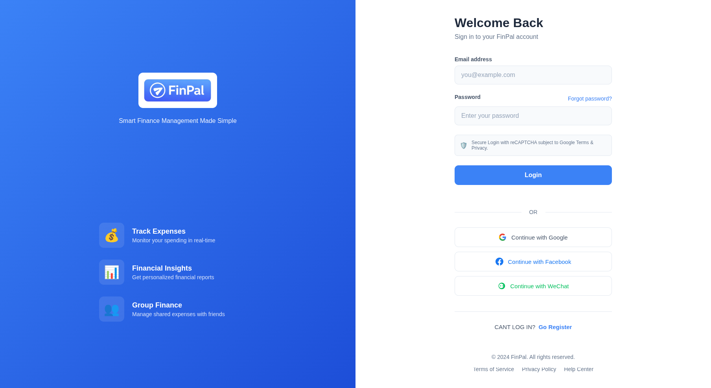
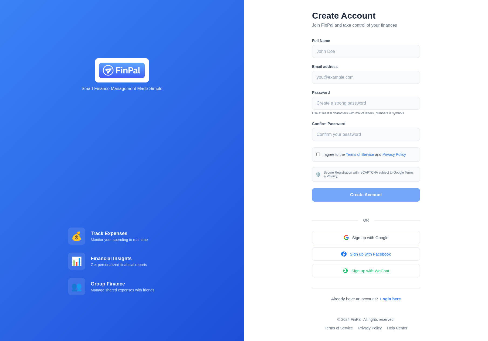
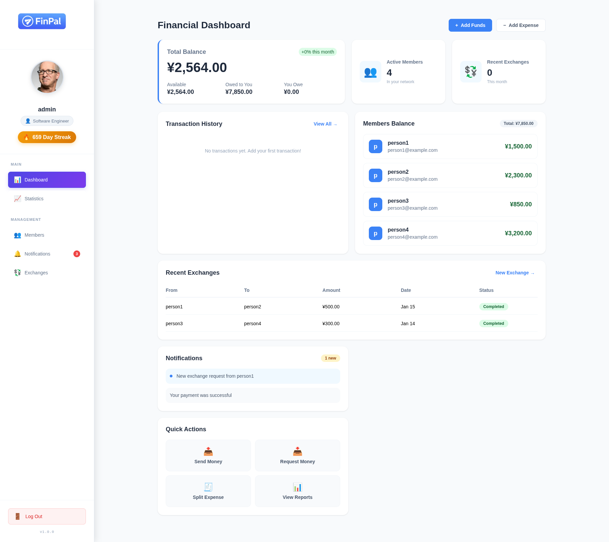
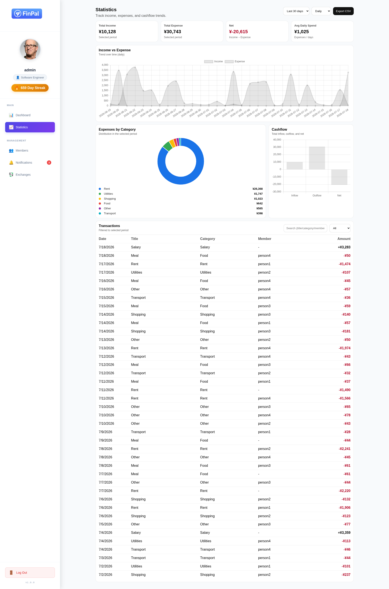
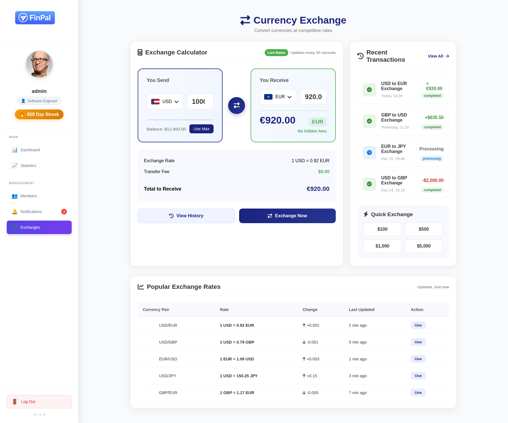
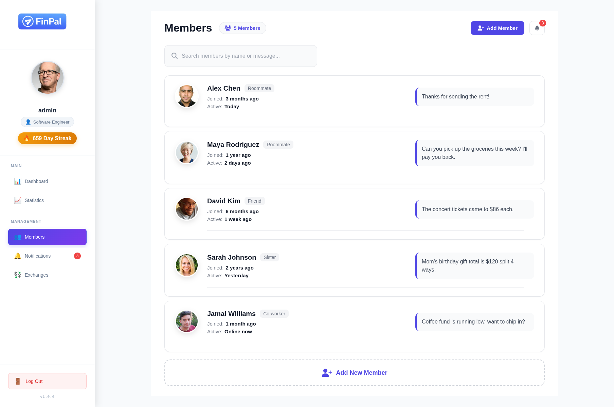
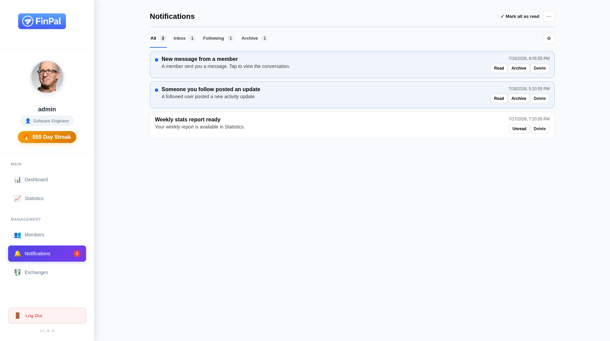

# FinPal

FinPal is a modern personal finance management web application built with Vue 3. It allows users to track income and expenses, manage shared balances, analyze financial activity, and visualize spending data through interactive dashboards.

## Overview

FinPal was designed to simplify personal financial management by providing a clean and intuitive interface for monitoring transactions, managing members, and viewing financial statistics.

## Tech Stack

* Vue.js 3
* Vue Router 4
* Pinia
* Element Plus
* Chart.js
* Bootstrap Vue

## Features

* Secure login and registration system
* Financial dashboard with balance overview
* Income and expense tracking
* Shared balance and member management
* Transaction history and notifications
* Interactive statistics and analytics
* Currency exchange support
* Search and filtering capabilities

## Project Structure

```text
src/
├── components/
├── views/
├── store/
├── router/
└── assets/
```

## Preview

### Authentication

<table>
  <tr>
    <td></td>
    <td></td>
  </tr>
</table>

### Dashboard



### Statistics and Analytics

<table>
  <tr>
    <td></td>
    <td></td>
  </tr>
</table>

### Members and Notifications

<table>
  <tr>
    <td></td>
    <td></td>
  </tr>
</table>

## Installation

```bash
git clone https://github.com/hishamcyber/finpal.git

cd finpal

npm install

npm run serve
```

## Skills Demonstrated

* Frontend development with Vue 3
* State management using Pinia
* SPA architecture and routing
* Component-based design
* Data visualization with Chart.js
* Responsive user interface design
* Financial data management

## Author

Developed by Hicham Ouahbi.
